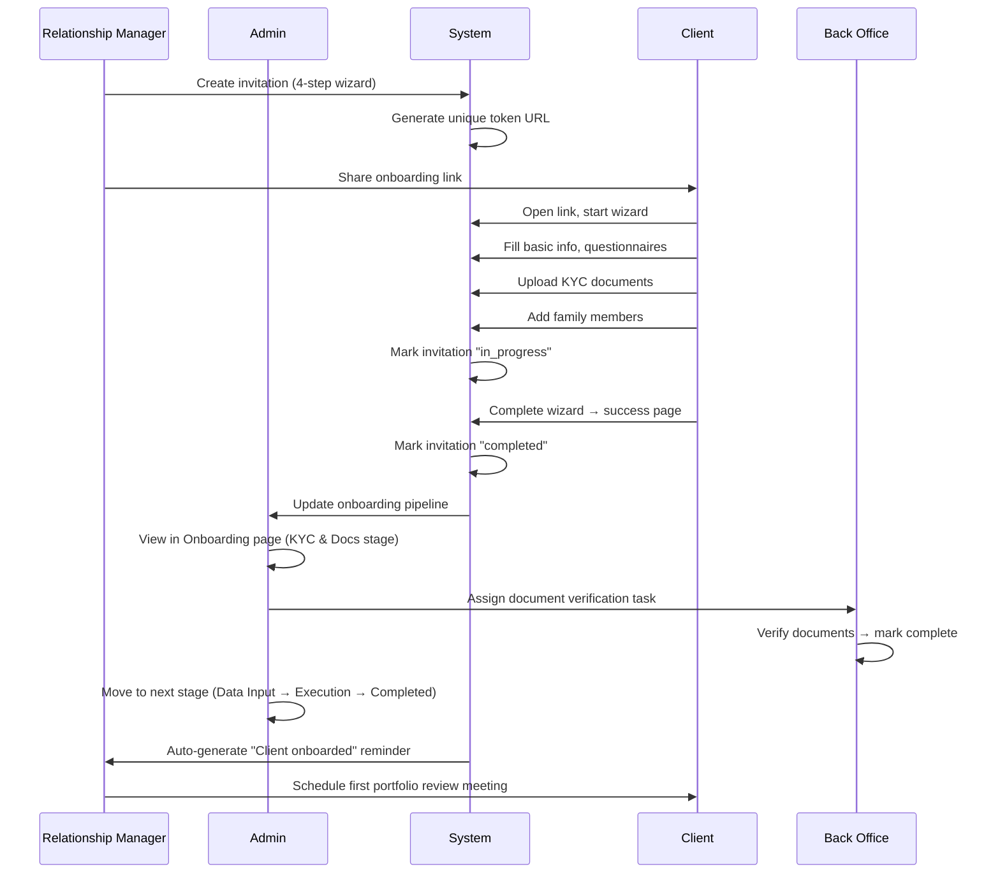

# NRP CRM — User Journeys

> Comprehensive user journey documentation for every persona in the NRP Wealth Management CRM.

---

## Table of Contents

1. [Login & Authentication](#1-login--authentication)
2. [Admin Persona](#2-admin-persona)
3. [Relationship Manager (RM) Persona](#3-relationship-manager-rm-persona)
4. [Client Persona](#4-client-persona)
5. [Back-Office Persona](#5-back-office-persona)
6. [Cross-Persona: Client Onboarding Flow](#6-cross-persona-client-onboarding-flow)

---

## 1. Login & Authentication

**Route:** `/auth/login`  
**Credentials:**

| Persona              | Username     | Password   |
|----------------------|-------------|------------|
| Admin                | `admin`     | `admin123` |
| Relationship Manager | `rm`        | `rm123`    |
| Client (Sharma)      | `sharma`    | `demo123`  |
| Back Office          | `backoffice`| `bo123`    |

### Journey

1. **Arrive at Login Page** — Light-themed enterprise UI with NRP branding.
2. **Choose Login Method:**
   - **Manual Login** — Enter username & password, click "Sign In".
   - **Quick Access Cards** — Click any persona card (Admin / RM / Client / Back Office) to auto-fill credentials and login instantly.
3. **Preview Onboarding** — Click "Preview Client Onboarding Journey" at the bottom to see the client-facing onboarding wizard without logging in.
4. **Redirect** — On successful login, the system redirects to the persona-specific dashboard:
   - Admin → `/admin/dashboard`
   - RM → `/rm/dashboard`
   - Client → `/client/dashboard`
   - Back Office → `/back-office/dashboard`
5. **Logout** — Available from the sidebar footer on every authenticated page.

---

## 2. Admin Persona

> **Role:** Full system oversight — monitors all families, AUM, onboarding pipelines, compliance, and platform-wide operations.

### Sidebar Navigation

| Menu Item      | Route                        |
|---------------|------------------------------|
| Dashboard     | `/admin/dashboard`           |
| Clients       | `/admin/clients`             |
| Onboarding    | `/admin/onboarding`          |
| Onboard Client| `/admin/onboarding/invite`   |
| Reminders     | `/admin/reminders`           |

---

### 2.1 Admin Dashboard

**Route:** `/admin/dashboard`

#### What the Admin Sees

- **Stat Cards:**
  - Total System AUM (₹ in Cr/L format)
  - System-wide avg returns (%)
  - Compliance reviews pending
  - System revenue this month
- **Charts:**
  - Historical AUM trend (area chart, 12-month)
  - AUM by client tier (pie chart)
  - Revenue breakdown by service type (bar chart)
  - Client status summary
- **Quick Action Banner** — Alerts for pending compliance reviews.

#### User Journey

1. Open Admin Dashboard → view platform health at a glance.
2. Review AUM trend chart → identify growth or decline patterns.
3. Check compliance pending count → navigate to clients or reminders.
4. Review revenue breakdown → understand fee distribution across service types.
5. Click "Review Clients" on the alert banner → navigate to Clients page.

---

### 2.2 Client Management

**Route:** `/admin/clients`

#### Features

- **Client Table** — All families listed with:
  - Family name, primary contact, tier, AUM, status, service type.
- **Search & Filter** — Search by family name; filter by status/tier.
- **Client Actions:**
  - **View Details** — Opens `ClientDetailDialog` with full family profile, portfolio summary, risk assessment, meeting history, documents.
  - **Edit Client** — Opens `ClientEditDialog` to update tier, service type, assigned RM, status.
  - **Create Client** — Opens `ClientCreateDialog` to add a new family.
  - **Invite Client** — Opens `ClientInviteDialog` to send an onboarding invitation.
- **Warning Badges** — Visual indicators for compliance issues, overdue reviews, or missing documents.

#### User Journey

1. Navigate to Clients → see all families in a sortable table.
2. Search for "Sharma" → filtered results appear.
3. Click "View" on Sharma Family → detail dialog opens showing portfolio, members, documents.
4. Click "Edit" → change tier from "Tier 2" to "Tier 1", save.
5. Click "Invite" → send a new onboarding link to an additional family member.

---

### 2.3 Invitation Management

**Route:** `/admin/clients/invitations`

#### Features

- **Invitations Table** — All client onboarding invitations with:
  - Client name, email, service type, status (pending/in_progress/completed/expired/revoked), created date, expiry countdown.
- **Status Badges** — Color-coded by invitation state.
- **Actions:**
  - **Copy Link** — Copy the onboarding URL to clipboard.
  - **Resend** — Resend the invitation email.
  - **Revoke** — Cancel an active invitation.
  - **View Details** — See detailed invitation config including selected questionnaires and documents.

#### User Journey

1. Navigate to Clients → Invitations sub-page.
2. Review all pending invitations → check which clients haven't started.
3. Resend invitation for a client who hasn't responded.
4. Revoke an expired invitation and create a new one.

---

### 2.4 Onboarding Pipeline

**Route:** `/admin/onboarding`

#### Features

- **Onboarding Metrics (Stat Cards):**
  - Total checklists, Pending verification, In progress, Completed.
- **Stage Filtering** — Tabs to filter by onboarding stage:
  - All | KYC & Docs | Data Input | Execution | Completed.
- **Checklist Cards** — Each card shows:
  - Family name, service type (NRP Light / NRP 360°), progress bar (%), verification status, current stage.
- **Actions:**
  - **View Details** → Navigates to `/admin/onboarding/checklists/[id]` for document-level verification.
  - **New Checklist** → Creates a new onboarding checklist (auto-generates conditional items based on service type).

#### User Journey

1. Open Onboarding page → see pipeline metrics.
2. Click "KYC & Docs" tab → filter to families in document collection stage.
3. Identify a family with 60% progress → click "View Details".
4. On Checklist Detail page → review individual items, verify uploaded documents, mark as approved/rejected.
5. When all docs verified → move checklist to next stage.

---

### 2.5 Onboard Client (Invite Wizard)

**Route:** `/admin/onboarding/invite`

#### 4-Step Wizard

| Step | Name               | Description                                                                 |
|------|--------------------|-----------------------------------------------------------------------------|
| 1    | Client Details     | Enter client name, email, phone, select service type (NRP Light / NRP 360°) |
| 2    | Questionnaires     | Select which questionnaires to include (pre-profiler, risk, goals, tax, ESG, insurance) |
| 3    | Documents          | Select required document uploads (KYC, bank statements, ITR, etc.)          |
| 4    | Review & Send      | Review the full configuration, copy link, or send invitation                |

#### User Journey

1. Click "Onboard Client" in sidebar.
2. **Step 1:** Enter "Amit Patel", email, phone → select "NRP 360°" → Next.
3. **Step 2:** Default questionnaires pre-selected based on service type → optionally toggle additional ones → Next.
4. **Step 3:** Default documents pre-selected → add "Cancelled Cheque" → Next.
5. **Step 4:** Review summary → click "Send Invitation".
6. System generates a unique token URL → copy link and share with client.
7. Invitation appears in the Invitations table with "Pending" status.

---

### 2.6 Reminders

**Route:** `/admin/reminders`

#### Features

- **Stat Cards:** Overdue | Due Today | Due This Week | Completed This Month.
- **Reminder List** — Grouped by status with priority badges (Critical/High/Medium/Low).
- **CRUD Operations:**
  - **Create** — New reminder with title, description, context type, family, priority, due date/time, recurring options, tags.
  - **Complete** — Mark as done.
  - **Snooze** — Postpone with a reason (opens snooze dialog with preset options).
  - **Delete** — Remove reminder with confirmation.
- **Recurring Reminders** — Supports daily/weekly/monthly/yearly patterns with end dates.
- **Auto-Triggers** — System automatically generates reminders based on business rules (overdue reviews, document expirations, etc.).

#### User Journey

1. Open Reminders → check overdue count.
2. Click "New Reminder" → create "Follow up on Sharma KYC" for tomorrow, high priority.
3. Review existing reminders → snooze a low-priority one for 3 days.
4. Mark a completed task → toast confirms completion.

---

## 3. Relationship Manager (RM) Persona

> **Role:** Manages assigned families — portfolio oversight, onboarding, meetings, and client relationship management.

### Sidebar Navigation

| Menu Item      | Route              |
|---------------|-------------------|
| Dashboard     | `/rm/dashboard`    |
| My Clients    | `/rm/clients`      |
| Onboard Client| `/rm/onboarding`   |
| Reminders     | `/rm/reminders`    |

---

### 3.1 RM Dashboard

**Route:** `/rm/dashboard`

#### Stat Cards

- **Total AUM** — Sum of assigned families' portfolio values (₹ in Cr/L).
- **Portfolio Performance** — Average 1Y returns (%).
- **Risk Reviews Due** — Count of families needing risk reassessment.
- **Revenue** — Fee revenue collected this month.

#### 4 Dashboard Tabs

| Tab               | Content                                                     |
|-------------------|-------------------------------------------------------------|
| **Overview**      | AUM trend chart (area), risk profile distribution (radial bar), alert banner for reviews due, quick actions. |
| **My Clients**    | Inline client table with AUM, risk profile, review status, search, and "View Details" per family. |
| **Calendar**      | Monthly calendar view with event dots (meetings, calls, deadlines, reviews), event filter by type, upcoming events sidebar, navigation between months. |
| **Tasks & Reminders** | Embedded reminder list filtered to RM's assigned families.  |

#### User Journey

1. Open RM Dashboard → review Total AUM (₹1.6 Cr) and Revenue (₹13.7 K).
2. Notice "2 Client Reviews Due" alert → click "Review Clients".
3. Switch to **My Clients** tab → see Sharma and Patel families.
4. Click "View" on Sharma Family → see portfolio details, holdings, AUM.
5. Switch to **Calendar** tab → see today's meeting with Sharma Family at 10:00 AM.
6. Navigate to next month → check upcoming scheduled reviews.
7. Switch to **Tasks & Reminders** tab → review pending follow-ups.

---

### 3.2 My Clients

**Route:** `/rm/clients`

#### Features

- **Client Cards/Table** — Shows each assigned family with:
  - Family name, primary contact, AUM (formatted in ₹), risk profile, onboarding status.
- **Search** — Filter clients by name.
- **View Details** — Opens `ClientDetailDialog` with portfolio breakdown, family members, documents, and meeting notes.
- **Status Badges** — Active, Onboarding, Review Due.

#### User Journey

1. Navigate to My Clients → see all assigned families.
2. Search "Patel" → filtered to Patel Family.
3. Click "View Details" → review family portfolio, recent transactions, upcoming meetings.
4. Note that risk review is overdue → plan a review meeting.

---

### 3.3 Onboard Client (Invite Wizard)

**Route:** `/rm/onboarding`

#### 4-Step Wizard (Same as Admin)

| Step | Action                                                                  |
|------|------------------------------------------------------------------------|
| 1    | Enter client details (name, email, phone) and select service type      |
| 2    | Choose questionnaires from a configurable pool                         |
| 3    | Choose required document uploads                                        |
| 4    | Review & Send — generates a unique onboarding link for the client      |

#### Additional Features

- **Invitation History** — View previously sent invitations with status tracking.
- **Copy Link** — Copy the generated onboarding URL.
- **Service Type Logic** — NRP 360° includes all questionnaires; NRP Light includes only essential ones.

#### User Journey

1. Click "Onboard Client" in sidebar.
2. Fill in new client details → select "NRP Light".
3. Review auto-selected questionnaires (basic_info, pre_profiler, risk_profile) → add one more.
4. Confirm documents needed → send invitation.
5. Share the link with the client via email/WhatsApp.
6. Track invitation status in the history section.

---

### 3.4 Reminders

**Route:** `/rm/reminders`

Identical to Admin Reminders but **scoped to RM's assigned families only**.

#### Key Differences from Admin

- Shows reminders only for families assigned to this RM.
- System auto-generates reminders for RM-specific events (upcoming reviews, SIP renewals).
- Can only create reminders for assigned families.

---

## 4. Client Persona

> **Role:** View-only access to personal portfolio, family details, documents, and onboarding progress.

### Sidebar Navigation

| Menu Item  | Route               |
|-----------|---------------------|
| Dashboard | `/client/dashboard`  |

---

### 4.1 Client Dashboard

**Route:** `/client/dashboard`

#### Stat Cards

- **Portfolio Value** — Total current value (₹1.1 Cr).
- **Total Returns** — Unrealized gain (₹13.9 L, +15.1%).
- **XIRR** — Annualized return (15.1%).
- **Recent Activity** — Transaction count in last 30 days.

#### Quick Actions Widget

| Action            | Behavior                                  |
|-------------------|-------------------------------------------|
| Message RM        | Navigates to `/communications`            |
| Schedule Meeting  | "Coming soon" toast                       |
| Upload Document   | Opens document upload dialog              |

#### 3 Dashboard Tabs

| Tab              | Content                                                         |
|------------------|-----------------------------------------------------------------|
| **Portfolio**    | Holdings table (sortable by value/P&L/P&L%), asset allocation chart, portfolio summary with invested vs current value. |
| **Transactions** | Transaction history with dates, types (buy/sell/SIP/dividend), amounts, status (completed/pending/failed). |
| **Family**       | Family overview card (service type, tier, risk profile, onboarding date) + family members list with avatars and relationship tags. |

#### Bottom Widgets

- **Upcoming Meetings** — Next 3 scheduled meetings with RM (title, date, time, join button).
- **Recent Documents** — Last 3 uploaded documents (name, type, status, download button).

#### User Journey

1. Login as "sharma" → see "Welcome back, Rajesh Sharma!".
2. Review Portfolio Value (₹1.1 Cr) and Total Returns (₹13.9 L).
3. **Portfolio tab** → view all 10 holdings sorted by current value.
   - See HDFC Flexi Cap Fund at the top, Nippon India Small Cap showing +34.4% gain.
   - Check asset allocation breakdown.
4. **Transactions tab** → review recent SIP credits and dividend payouts.
5. **Family tab** → see Sharma Family details:
   - Service Type, Client Tier, Risk Profile, Onboarding date.
   - Family member: Rajesh Sharma (Self, Primary Contact).
6. Check "Upcoming Meetings" → see "Quarterly Portfolio Review" scheduled with RM.
7. Click "Upload Document" → upload ITR for AY 2025-26.
8. Click "Message RM" → navigate to communications.

---

### 4.2 Client Onboarding Wizard

**Route:** `/client/onboarding/[token]`  
**Access:** Via invitation link shared by RM/Admin (no login required).

#### Dynamic Steps (Based on Invitation Config)

Steps are dynamically generated based on what the RM/Admin selected during invitation:

| Step                | Description                                                     |
|---------------------|-----------------------------------------------------------------|
| **Basic Information** | Full name, email, phone, PAN, date of birth, address           |
| **Investor Profile**  | Pre-profiler questionnaire — investment experience, income sources, financial literacy |
| **Risk Assessment**   | Risk tolerance questions — market drop reaction, investment horizon, volatility comfort |
| **Financial Goals**   | Share financial objectives and milestones                       |
| **Tax Planning**      | Tax status, saving instruments, HUF status                     |
| **ESG Preferences**   | Environmental/Social/Governance investing preferences           |
| **Insurance Review**  | Existing coverage assessment and gap identification             |
| **Document Upload**   | Upload KYC docs (PAN, Aadhaar, bank statement, etc.) per requirements |
| **Family Members**    | Add spouse, children, parents with relationship, email, phone   |

#### User Journey

1. Client receives onboarding link from RM.
2. Opens link → sees branded NRP onboarding wizard with progress bar.
3. **Step 1 (Basic Info):** Fills in personal details → Next.
4. **Step 2 (Investor Profile):** Answers pre-profiler questions → system records responses.
5. **Step 3 (Risk Assessment):** Answers risk tolerance questions → system calculates risk score.
6. **Step 4-7 (Conditional):** Depending on service type and RM configuration, fills additional questionnaires.
7. **Document Upload:** Uploads PAN card, Aadhaar, bank statement → each is verified by back-office.
8. **Family Members:** Adds spouse and child details.
9. **Completion:** Redirected to `/client/onboarding/success` — success confirmation page.
10. Back-office team processes uploaded documents; Admin monitors via Onboarding Pipeline.

---

### 4.3 Demo Onboarding Preview

**Route:** `/client/onboarding/demo-preview`  
**Access:** From login page CTA — "Preview Client Onboarding Journey".

- Shows a **demo banner** at the top: "This is what your client will see during onboarding".
- Full onboarding wizard with demo data pre-configured (NRP 360° service type).
- No actual data is saved; purely for demonstration purposes.
- "Back to Login" link in the banner.

---

### 4.4 Onboarding Edge Cases

| Route                           | Purpose                                           |
|--------------------------------|---------------------------------------------------|
| `/client/onboarding/success`    | Success page shown after completing onboarding    |
| `/client/onboarding/expired`    | Shown when an invitation link has expired          |

---

## 5. Back-Office Persona

> **Role:** Operational processing — task execution, document verification, compliance coordination.

### Sidebar Navigation

| Menu Item       | Route                   |
|----------------|-------------------------|
| Dashboard      | `/back-office/dashboard` |
| Assigned Tasks | `/back-office/tasks`     |
| Reminders      | `/back-office/reminders` |

---

### 5.1 Back-Office Dashboard

**Route:** `/back-office/dashboard`

#### Stat Cards

- Pending Tasks, Completed Today, Avg Processing Time, Documents Pending.

#### Content

- **Recent Activity Feed** — Timeline of recent operations (verifications, approvals, completions).
- **Task Summary** — Quick view of task distribution by type.
- **Performance Metrics** — Processing efficiency stats.

#### User Journey

1. Open Back-Office Dashboard → review pending task count.
2. Check "Documents Pending" stat → prioritize document verifications.
3. Review recent activity → identify bottlenecks in processing.

---

### 5.2 Assigned Tasks

**Route:** `/back-office/tasks`

#### Features

- **Task Table/Cards** — All assigned tasks with:
  - Title, description, family name, priority (critical/high/medium/low), status, due date.
- **Status Filtering** — Filter by: All | Pending | In Progress | Completed.
- **Search** — Search tasks by title or family name.
- **Status Transitions:**
  - `pending` → `in_progress` → `completed`
  - Each transition updates the task and logs the timestamp.
- **CRUD Operations:**
  - **Create Task** — New task with title, description, priority, family assignment, due date.
  - **Update Status** — Progress task through status pipeline.
  - **Delete Task** — Remove with confirmation.
- **Persistence** — All tasks stored in localStorage.

#### User Journey

1. Navigate to Assigned Tasks → see all pending tasks.
2. Filter by "Pending" → focus on unstarted work.
3. Click "Start" on "Verify Sharma KYC Documents" → status changes to "In Progress".
4. Process the verification → click "Complete" → status changes to "Completed".
5. Create a new task → "Process Patel Family bank statement reconciliation", High priority, due tomorrow.
6. Search for "Patel" → see the newly created task.

---

### 5.3 Reminders

**Route:** `/back-office/reminders`

Same functionality as RM/Admin Reminders — full CRUD with create, complete, snooze, delete. Scoped to back-office operational reminders.

#### User Journey

1. Open Reminders → check overdue items.
2. Create reminder: "Follow up on Patel cancelled cheque" → due in 2 days.
3. Snooze a non-urgent reminder to next week.
4. Mark operational reminders as complete after processing.

---

## 6. Cross-Persona: Client Onboarding Flow

> The end-to-end onboarding journey spans multiple personas working together.

### Step-by-Step

| Step | Persona    | Action                                                          | Route                              |
|------|------------|----------------------------------------------------------------|-------------------------------------|
| 1    | RM/Admin   | Create onboarding invitation with wizard                       | `/rm/onboarding` or `/admin/onboarding/invite` |
| 2    | RM         | Copy link and share with client                                 | —                                   |
| 3    | Client     | Open link, complete onboarding wizard                           | `/client/onboarding/[token]`        |
| 4    | System     | Auto-update invitation status                                   | —                                   |
| 5    | Admin      | Monitor pipeline, review documents                              | `/admin/onboarding`                 |
| 6    | Admin      | Verify checklist items, approve/reject documents                 | `/admin/onboarding/checklists/[id]` |
| 7    | Back Office| Process assigned verification tasks                             | `/back-office/tasks`                |
| 8    | Admin      | Move client through stages (KYC → Data Input → Execution → ✅) | `/admin/onboarding`                 |
| 9    | RM         | Get notified, schedule first portfolio review                    | `/rm/reminders`                     |
| 10   | Client     | Access full dashboard with portfolio data                        | `/client/dashboard`                 |

---

## Appendix: Route Map

| Route                                     | Persona      | Purpose                                    |
|------------------------------------------|-------------|---------------------------------------------|
| `/auth/login`                             | All          | Login page with quick-access cards          |
| `/admin/dashboard`                        | Admin        | System-wide metrics and charts              |
| `/admin/clients`                          | Admin        | Client management (CRUD, search, filter)    |
| `/admin/clients/invitations`              | Admin        | Invitation tracking and management          |
| `/admin/onboarding`                       | Admin        | Onboarding pipeline with stage filtering    |
| `/admin/onboarding/invite`                | Admin        | 4-step invitation creation wizard           |
| `/admin/onboarding/checklists/[id]`       | Admin        | Checklist detail with item-level verification|
| `/admin/reminders`                        | Admin        | Reminder management (CRUD, snooze)          |
| `/rm/dashboard`                           | RM           | Wealth dashboard with 4 tabs                |
| `/rm/clients`                             | RM           | Assigned clients overview                   |
| `/rm/onboarding`                          | RM           | 4-step invitation creation wizard           |
| `/rm/reminders`                           | RM           | Personal reminders for assigned families    |
| `/client/dashboard`                       | Client       | Portfolio, transactions, family tabs        |
| `/client/onboarding/[token]`              | Client       | Dynamic onboarding wizard (via invite link) |
| `/client/onboarding/demo-preview`         | Public       | Demo preview of onboarding wizard           |
| `/client/onboarding/success`              | Client       | Onboarding completion confirmation          |
| `/client/onboarding/expired`              | Client       | Expired invitation message                  |
| `/back-office/dashboard`                  | Back Office  | Operational metrics and activity feed       |
| `/back-office/tasks`                      | Back Office  | Task management with status pipeline        |
| `/back-office/reminders`                  | Back Office  | Operational reminders                       |
